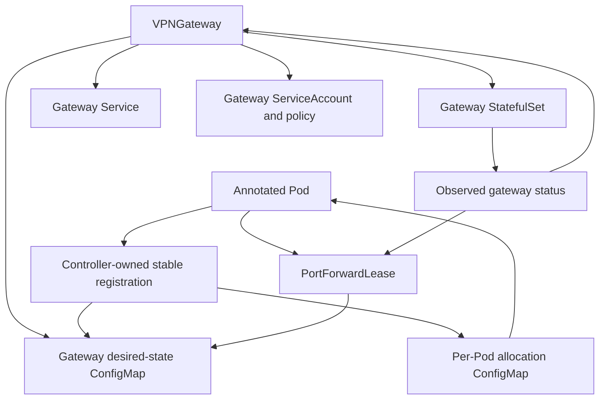

# Architecture

## Context

Waycloak separates the control plane from the data plane. Kubernetes resources declare desired gateway and workload membership. The controller and admission webhook turn that intent into injected agents and gateway configuration. Packet forwarding happens locally in Pod network namespaces and in shared gateway Pods; it never traverses the controller.

## Components

### Controller manager

Reconciles `VPNGateway`, derived workload registrations, and `PortForwardLease` resources. It owns stable allocation, desired gateway configuration, status, finalization, and events. It must not require packet-path availability to continue reconciling unrelated resources.

### Admission webhook

Mutates opted-in Pods before creation. It validates the referenced gateway and namespace authorization, injects preparation and verification init containers plus a long-running agent container, references a deterministic per-Pod allocation ConfigMap name, and records an injection version. The webhook is idempotent. Unannotated Pods are returned unchanged.

The initial design does not require Kubernetes native sidecar containers. Required init containers install fail-closed state and wait for a healthy protected path before application containers start. A conventional agent sidecar then monitors and repairs the path while the application runs. This broadens Kubernetes-version compatibility while retaining safe startup ordering.

The failure policy must be scoped carefully: an unavailable webhook must not block unrelated Pods, while an opted-in Pod must never be admitted without protection. One viable design uses a fail-open webhook plus a validating policy that rejects annotated but uninjected Pods; this requires explicit end-to-end proof before adoption.

### Routing agent

Runs in the protected Pod's network namespace and owns only Waycloak-created interfaces, routes, DNS configuration, and firewall chains. It installs fail-closed rules, brings up the VXLAN peer, verifies gateway reachability, and continuously repairs drift. It never receives provider credentials.

### Gateway manager

Runs beside the VPN engine in the gateway Pod. It configures overlay peers, forwarding/NAT, DNS forwarding, tunnel health checks, and provider port leases. Desired state arrives through a versioned ConfigMap or local control API; long term, a local API avoids rewriting large configs for each membership change.

### VPN engine and capability drivers

The initial engine is Gluetun. The current `v0.2` controller translates a
limited provider shape into Gluetun environment variables; issue #66 migrates
that compatibility surface to operator-supplied native configuration under
ADR 0017. Waycloak owns the engine Pod lifecycle and the small integration
boundary required by the shared network namespace; it does not aim to mirror
Gluetun's provider settings. Engine observation and provider-specific behavior
are abstracted behind capabilities:

- tunnel status;
- observed public IP;
- port-forward support;
- lease acquisition and renewal;
- maximum simultaneous leases;
- supported protocols.

Waycloak does not assume that all providers or protocols support port forwarding.

### Workload adapters

Most applications require no adapter. When an application must apply
provider-assigned metadata through a proprietary API, a separate unprivileged
OCI sidecar implements the versioned Pod-local adapter protocol. It receives
only the neutral lease contract and explicitly selected workload-owned
configuration. Exact-generation acknowledgement returns through the local
agent; adapters never run in a Waycloak control-plane or privileged data-plane
process. ADR 0018 defines this extension boundary.

### Lease delivery agent

The existing routing agent validates the Pod-UID-bound lease document from the controller-owned allocation ConfigMap, rejects malformed or expired records, and exposes the current document read-only on Pod loopback port 9809. Admission can project only `port-forward-leases.json` into one explicitly selected application container; allocation internals and Kubernetes credentials remain unavailable there. The controller reads an identity-specific observation from the agent health port and requires the exact Pod UID, lease UID, generation, and expiry before reporting delivery ready. A deterministic digest annotation prompts kubelet projection refresh during short provider renewals without a workload restart. Environment-only applications opt into a supervisor that stops its child on lease loss or generation change and restarts it only with a current ready record; the controller does not roll arbitrary workload owners. ADR 0011 defines the delivery and ownership boundary.

The initial lease controller accepts only a non-empty Pod selector resolving to
exactly one eligible Pod. `Fixed` requires whole-Pod readiness;
`ProviderAssigned` requires a Running Pod with its injected Waycloak agent Ready
so application-adapter readiness can remain the final delivery gate. It binds
status to that Pod UID and the same-gateway `VPNWorkload` overlay allocation; it
never treats labels alone as a packet target. ADR 0012 defines this stable
identity and cardinality boundary.

For Proton/OpenVPN, the tokenless gateway manager owns the renewable NAT-PMP
mapping because its Linux socket is bound to the VPN interface. The controller
publishes stable UID/internal-port intents through the gateway ConfigMap and
reads a limited observation from the exact serving gateway Pod. This channel
contains no credentials and cannot make `GatewayRulesReady` or `Delivered`
true. ADR 0013 defines renewal, rotation, and deletion quarantine.

## Resource ownership

`VPNWorkload` is a controller-created, publicly inspectable CRD but not user-authored intent. It stores stable allocation and observed status. Allocations must not be recomputed by sorting current names.

The initial `VPNGateway` workload is a deliberate one-replica StatefulSet behind a headless Service. Both are directly owned by the gateway resource, so Kubernetes garbage collection is sufficient and no broad gateway finalizer is required. Provider credentials are a non-optional Secret volume mounted only into the engine container; the gateway manager does not receive that mount, and automounted ServiceAccount tokens are disabled for the entire Pod. The engine and gateway-manager images must be immutable digest references before the controller creates either resource.

Gateway status remains observation-driven during incremental implementation. A created StatefulSet does not imply a tunnel, overlay, DNS, or ready gateway. Until the manager implements and verifies each component, the corresponding condition remains false with a stable not-implemented or not-ready reason.

For Gluetun, the manager observes the engine through its loopback-only external-health server and control endpoints. A controller-owned ConfigMap grants only the DNS-status and public-IP GET routes; mutating, tunnel-control, and settings routes remain unavailable. The adapter discards response bodies on errors and returns typed observations so credential material or provider response content cannot enter Kubernetes events or logs.

Engine-native Gluetun configuration remains operator-owned. Non-secret
ConfigMaps enter only through container `envFrom`; ConfigMap and Secret files
mount read-only only into the engine. The controller reads non-secret inputs to
reject reserved integration settings and derive an opaque rollout digest, but
never reads Secret content. The manager and renderer receive no native mounts.
ADR 0022 records the projection and migration boundary.

The same ConfigMap carries deterministic gateway desired-state JSON. Each member record joins a persisted `VPNWorkload` identity and overlay allocation to the UID-matched Pod's observed underlay IP. The controller hashes the canonical member records into a desired membership generation. The manager has no Kubernetes credentials, validates the entire snapshot before applying it, and advances its tokenless last-known-good applied generation only after network, forwarding, gateway port-rule, and DNS reconciliation succeed. The controller polls that observation while desired and applied generations differ or observation fails; observation failures keep gateway readiness false and trigger requeue. A malformed or partially projected document leaves the previously applied kernel state and generation intact. Ordering is deterministic only for reproducible serialization; identities and addresses remain persisted values and are never derived from list position.

Gateway packet policy is deny-first. The manager installs a Waycloak-owned nftables forward-drop chain before creating VXLAN, then activates only overlay-to-VPN forwarding, connection-tracked return traffic, and VPN-interface masquerade. Gluetun continues to own local input/output containment. Its supported static post-rules hook delegates only the shared namespace's forward policy and narrowly opens overlay DNS/readiness input; ADR 0009 records this engine boundary. The production DNS proxy sends cluster search zones to the observed Kubernetes resolver and every other query to Gluetun's loopback protected resolver.

## Lifecycle

### Adding protection

1. Developer adds the gateway annotation to a Pod template.
2. Workload controller creates a new Pod during rollout.
3. Admission validates authorization, injects Waycloak components, and references a required allocation ConfigMap derived from namespace and Pod name.
4. The new Pod remains pending because its allocation ConfigMap does not exist yet.
5. Controller observes the Pod, persists a UID-bound `VPNWorkload` allocation, creates the ConfigMap with a Pod owner reference, and updates gateway desired state.
6. Initial setup receives the allocation and installs deny rules before opening overlay egress.
7. Agent establishes VXLAN and verifies gateway health.
8. Application starts; external traffic can only use the gateway.

The allocation ConfigMap is deliberately non-optional. Controller failure leaves the Pod pending before any application container starts. The controller validates an existing ConfigMap's Pod UID before reuse so a same-name replacement cannot consume stale allocation data.

### Removing protection

1. Developer removes the annotation from the Pod template.
2. New Pods are not injected and use normal cluster networking.
3. Deleted protected Pods cause registrations and leases to be reclaimed after a safety delay.
4. Existing allocations never shift because another member disappeared.

### Gateway outage

1. Agents lose health/reachability.
2. Their fail-closed rules remain installed.
3. External traffic stops; cluster-local policy follows configured mode.
4. Controller and gateway status become unhealthy.
5. On recovery, agents rebuild only Waycloak-owned overlay state and reverify egress.

## Scaling model

The initial gateway is a deliberate singleton because one VPN tunnel and its provider leases are stateful. HPA must not clone it blindly. Capacity grows through named gateways or explicit shards, each with its own tunnel identity, address pool, leases, and failure domain.

Each gateway owns a `PodDisruptionBudget` with `minAvailable: 1`. It blocks voluntary eviction of the only tunnel Pod but cannot make the singleton highly available or prevent involuntary node loss. Gateway StatefulSets use `OnDelete`, so a reconciled image or template change emits `GatewayRolloutRequired` but cannot automatically terminate every tunnel. An operator activates each change by deleting one serving gateway Pod during an approved fail-closed maintenance window. The admission/controller Deployment instead runs at least two replicas with leader election, a zero-unavailable rolling strategy, and its own disruption budget so unannotated admission remains outside the webhook path and opted-in admission remains available during one voluntary disruption.

Future scheduling can assign clients to shards using stable hashing and disruption budgets. Seamless migration requires provider and application lease semantics and is not assumed.

## Packaging boundaries

Required OCI artifacts:

- controller/webhook image;
- agent image;
- gateway-manager image;
- Helm chart.

Optional artifacts:

- KCL module;
- conformant workload-adapter images;
- kubectl plugin;
- dashboards;
- provider-specific example bundles.

Gluetun remains an external pinned image dependency in the initial chart. Its
version and digest are part of the tested release bill of materials. Native
Gluetun configuration belongs to the operator; Waycloak reserves and validates
only the settings documented by ADR 0017.
