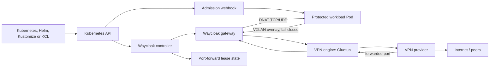
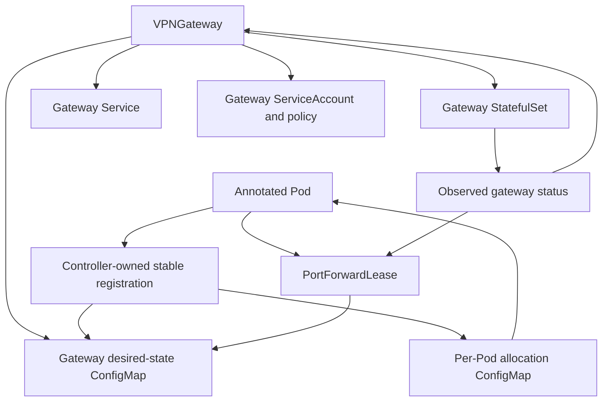

# Architecture

## Context

Waycloak separates the control plane from the data plane. Kubernetes resources declare desired gateway and workload membership. The controller and admission webhook turn that intent into injected agents and gateway configuration. Packet forwarding happens locally in Pod network namespaces and in shared gateway Pods; it never traverses the controller.

## Components

### Controller manager

Reconciles `VPNGateway`, derived workload registrations, and `PortForwardLease` resources. It owns stable allocation, desired gateway configuration, status, finalization, and events. It must not require packet-path availability to continue reconciling unrelated resources.

### Admission webhook

Mutates opted-in Pods before creation. It validates the referenced gateway and namespace authorization, injects preparation and verification init containers plus a long-running agent container, references a deterministic per-Pod allocation ConfigMap name, and records an injection version. The webhook is idempotent. Unannotated Pods are returned unchanged.

The initial design does not require Kubernetes native sidecar containers. Required init containers install fail-closed state and wait for a healthy protected path before application containers start. A conventional agent sidecar then monitors and repairs the path while the application runs. This broadens Kubernetes-version compatibility while retaining safe startup ordering.

The failure policy must be scoped carefully: an unavailable webhook must not block unrelated Pods, while an opted-in Pod must never be admitted without protection. One viable design uses a fail-open webhook plus a validating policy that rejects annotated but uninjected Pods; this requires explicit end-to-end proof before adoption.

### Routing agent

Runs in the protected Pod's network namespace and owns only Waycloak-created interfaces, routes, DNS configuration, and firewall chains. It installs fail-closed rules, brings up the VXLAN peer, verifies gateway reachability, and continuously repairs drift. It never receives provider credentials.

### Gateway manager

Runs beside the VPN engine in the gateway Pod. It configures overlay peers, forwarding/NAT, DNS forwarding, tunnel health checks, and provider port leases. Desired state arrives through a versioned ConfigMap or local control API; long term, a local API avoids rewriting large configs for each membership change.

### VPN engine and provider driver

The initial engine is Gluetun using OpenVPN or WireGuard as supported by the provider. Provider behavior is abstracted behind capabilities:

- tunnel status;
- observed public IP;
- port-forward support;
- lease acquisition and renewal;
- maximum simultaneous leases;
- supported protocols.

Waycloak does not assume that all providers or protocols support port forwarding.

### Lease delivery agent

Makes the neutral `PortForwardLease` record available inside the workload Pod without granting Kubernetes API access to the application. It may share the routing-agent binary and expose a read-only loopback endpoint plus an atomically updated file.

## Resource ownership

`VPNWorkload` is a controller-created, publicly inspectable CRD but not user-authored intent. It stores stable allocation and observed status. Allocations must not be recomputed by sorting current names.

The initial `VPNGateway` workload is a deliberate one-replica StatefulSet behind a headless Service. Both are directly owned by the gateway resource, so Kubernetes garbage collection is sufficient and no broad gateway finalizer is required. Provider credentials are a non-optional Secret volume mounted only into the engine container; the gateway manager does not receive that mount, and automounted ServiceAccount tokens are disabled for the entire Pod. The engine and gateway-manager images must be immutable digest references before the controller creates either resource.

Gateway status remains observation-driven during incremental implementation. A created StatefulSet does not imply a tunnel, overlay, DNS, or ready gateway. Until the manager implements and verifies each component, the corresponding condition remains false with a stable not-implemented or not-ready reason.

For Gluetun, the manager observes the engine through its loopback-only external-health server and control endpoints. A controller-owned ConfigMap grants only the DNS-status and public-IP GET routes; mutating, tunnel-control, and settings routes remain unavailable. The adapter discards response bodies on errors and returns typed observations so credential material or provider response content cannot enter Kubernetes events or logs.

## Lifecycle

### Adding protection

1. Developer adds the gateway annotation to a Pod template.
2. Workload controller creates a new Pod during rollout.
3. Admission validates authorization, injects Waycloak components, and references a required allocation ConfigMap derived from namespace and Pod name.
4. The new Pod remains pending because its allocation ConfigMap does not exist yet.
5. Controller observes the Pod, persists a UID-bound `VPNWorkload` allocation, creates the ConfigMap with a Pod owner reference, and updates gateway desired state.
6. Initial setup receives the allocation and installs deny rules before opening overlay egress.
7. Agent establishes VXLAN and verifies gateway health.
8. Application starts; external traffic can only use the gateway.

The allocation ConfigMap is deliberately non-optional. Controller failure leaves the Pod pending before any application container starts. The controller validates an existing ConfigMap's Pod UID before reuse so a same-name replacement cannot consume stale allocation data.

### Removing protection

1. Developer removes the annotation from the Pod template.
2. New Pods are not injected and use normal cluster networking.
3. Deleted protected Pods cause registrations and leases to be reclaimed after a safety delay.
4. Existing allocations never shift because another member disappeared.

### Gateway outage

1. Agents lose health/reachability.
2. Their fail-closed rules remain installed.
3. External traffic stops; cluster-local policy follows configured mode.
4. Controller and gateway status become unhealthy.
5. On recovery, agents rebuild only Waycloak-owned overlay state and reverify egress.

## Scaling model

The initial gateway is a deliberate singleton because one VPN tunnel and its provider leases are stateful. HPA must not clone it blindly. Capacity grows through named gateways or explicit shards, each with its own tunnel identity, address pool, leases, and failure domain.

Future scheduling can assign clients to shards using stable hashing and disruption budgets. Seamless migration requires provider and application lease semantics and is not assumed.

## Packaging boundaries

Required OCI artifacts:

- controller/webhook image;
- agent image;
- gateway-manager image;
- Helm chart.

Optional artifacts:

- KCL module;
- kubectl plugin;
- dashboards;
- provider-specific example bundles.

Gluetun remains an external pinned image dependency in the initial chart. Its version and digest are part of the tested release bill of materials.
