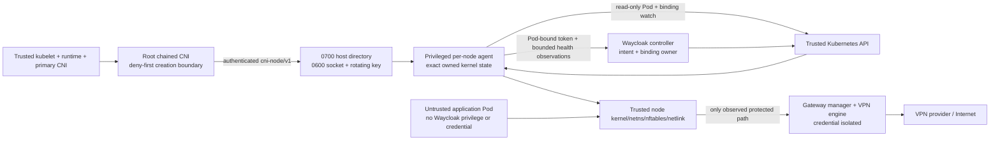

# Threat model

Status: clean-break stable architecture
Last updated: 2026-07-28

## Security claim

For an explicitly enrolled, non-privileged workload on a supported cluster,
Waycloak prevents the Pod sandbox from becoming runnable until deny-first
protection is installed, routes selected external traffic through the accepted
healthy VPN gateway, and blocks that traffic whenever the complete protected
path is unavailable or unverified.

This is a fail-closed routing claim within the trust boundaries below. It is not
an anonymity claim.

## Trust boundaries and data flow

The workload, workload owner, route labels, referenced objects, packet inputs,
and local-protocol bytes are untrusted. Kubernetes control-plane components,
kubelet/runtime, primary CNI, kernel, node root, verified Waycloak artifacts,
and the operator installing privileged components are trusted. The controller,
node agent, gateway manager, and VPN engine are separate compromise domains;
provider credentials cross only into the engine domain.

## Protected assets

- the node or ordinary public egress address from accidental protected-workload
  traffic;
- integrity of explicit enrollment, route authorization, UID-bound allocation,
  node assignment, and live readiness;
- VPN credentials and native provider configuration;
- integrity and confidentiality of port-forward control data;
- node-agent authentication key and exact owned kernel state;
- availability of unenrolled workloads and unrelated CNI/kernel state;
- private endpoints, public-IP history, account identifiers, and tenant metadata
  in diagnostics.

## Adversaries and failures considered

- compromised enrolled or unenrolled application containers without host
  access, Linux network capabilities, or Kubernetes credentials from Waycloak;
- hostile labels, routes, references, binding names, malformed protocol input,
  admission bypass, same-name Pod replacement, and UID/sandbox/netns reuse;
- a non-root node process attempting socket substitution, request forgery,
  response tampering, replay, oversized input, or denial of service;
- controller, admission, CNI, agent, gateway, tunnel, DNS, provider, runtime, or
  node restart/loss and reordering during startup, reconfiguration, and cleanup;
- stale state after process crash, upgrade, rollback, restore, node reimage, or
  incomplete uninstall;
- cross-namespace confused-deputy requests and existence-oracle attempts;
- accidental sensitive data emission in status, events, logs, metrics, and
  support bundles.

## Explicitly unsupported or out of scope

- malicious or compromised node root, kernel, kubelet, runtime, primary CNI,
  API server, etcd, Waycloak privileged agent, controller, gateway engine, or
  release supply chain;
- privileged, host-network, host-PID, host-IPC workloads, workloads with
  `NET_ADMIN`, `SYS_ADMIN`, BPF privilege, arbitrary device/host mounts, or
  access to the node-agent runtime directory;
- clusters that cannot safely chain CNI, run the privileged node agent, provide
  supported netns access, enforce required host-file permissions, or keep node
  clocks within the protocol freshness window;
- transparent protection of an already-running Pod, implicit namespace
  enrollment, or a fallback data plane;
- traffic correlation, provider logging, application/browser fingerprinting,
  account identity, or identity voluntarily placed in application payloads;
- cluster-local traffic explicitly declared `Preserve`, which is outside the
  selected VPN route but still subject to the documented cluster policy.

An unsupported category is rejected during preflight, scheduling, CNI `ADD`, or
capability resolution. It never receives a sidecar or ordinary-egress fallback.

## Privileged action and access matrix

| Action/resource | Owner | Least privilege | Observable failure | Revocation/recovery | Required test |
| --- | --- | --- | --- | --- | --- |
| Install CNI binary/conflist | explicit installer, never runtime agent | exact root-owned binary, conflist, and release-bound SHA-256 receipt; runtime mounts all three exact files read-only | node capability false; protected scheduling disabled; local lockdown restored | drain protected Pods, restore exact preimage and receipt, remove exact binary | install/rollback, tamper detection, and unrelated-chain preservation |
| Install first deny | root chained CNI | exact new Pod netns and UID-owned nftables only | `ADD` fails; sandbox not runnable | retained through later failure; unrecorded state rolls back | primary-CNI success then failed Waycloak ADD, zero packets |
| Authenticate local call | CNI and node agent | Linux root peer credentials, 0700 directory, 0600 socket/key, per-start 256-bit key, bounded HMAC envelope | generic authentication failure; `ADD/CHECK` fail | agent restart rotates key; bounded retry rereads key | non-root peer, wrong key/mode, tamper, replay, stale time, signed response |
| Allocate/resolve binding | controller + node agent | atomic gateway-owned Lease reservation; read-only Pod and binding cache; exact UID, generation and assigned node | conflict, exhaustion, missing/rejected/unobserved remains denied | authoritative reservation recovery; timeout creates durable quarantine | simultaneous allocation, stale informer, restart, UID/name reuse, missing reservation, hostile binding |
| Enter Pod netns | node agent | supported read-only netns mount and only proven `SYS_ADMIN`/privileged boundary | programming false; CNI failure or runtime withdrawal | exact dev/inode mismatch refuses action; GC quarantines stale record | netns path reuse, runtime restart, disappearing namespace |
| Program/repair kernel state | node agent | Waycloak-owned table/rules/routes/link in exact netns; `NET_ADMIN`; no arbitrary command API | Programmed/Ready false or unknown; packets denied | level-based repair or exact withdrawal | drift, foreign rules, partial transaction, agent restart |
| Watch Kubernetes | node agent | short-lived projected token; get/list/watch Pods and bindings only | local cache unknown; new setup denied; Ready unknown | token/watch renewal; deny remains | RBAC denial, watch closure, stale generation |
| Publish user status | controller | Pod-bound TokenReview resolves exact agent Pod UID/node; current binding must match that node; agent has no status write | stale/unknown conditions; relay loss withdraws node allow paths | authenticated relay and path re-verification | unbound token, cross-node report, stale binding, controller loss |
| Resolve gateway credential ref | controller | exact `get` only through an operator-granted namespaced binding; metadata-only client and no status value | `ResolvedRefs=False`; programming remains pending | reference or permission restoration requeues; removal withdraws | missing/forbidden Secret, value canary absent from status |
| Mount VPN credential | gateway engine | referenced Secret mounted read-only only into engine | gateway refs unresolved/not ready | Secret rotation restarts/reloads engine per class contract | agent/application mount absence; class/status redaction |
| Authorize cross-namespace ref | target owner + controller | explicit target-side consent; no tenant-writable authorization label | `ResolvedRefs=False/RefNotPermitted` without existence leak | consent removal withdraws programming/readiness | unauthorized existing/non-existing targets indistinguishable |
| Acquire provider port and program inbound rules | tokenless gateway runtime | TLS 1.3 mTLS from the exact controller SPIFFE identity; exact gateway UID; owned nftables table and provider session only | mapping/rules unknown or false; no successor activation | durable internal-port reservation, atomic rule repair, withdrawal and quarantine | capacity regression, restart, expiry, TCP/UDP symmetry, wrong UID/generation |
| Configure an application adapter | operator-authored immutable WorkloadAdapter | one exact unprivileged Pod, no API/VPN credential, host access, init/ephemeral container, or added capability; exact gateway-runtime mTLS identity | delivery/acknowledgement unknown or false; lease not ready | durable generation state, exact-Pod revalidation, withdraw before handoff | wrong Pod/address/generation, restart, stale record, failed withdrawal |
| Collect diagnostics | waycloakctl/controller | allowlisted fields and bounded recent events; no Secret/key/raw endpoint | bundle section reports redaction/unavailable | rotate disclosed material and regenerate | canary secrets/endpoints never appear |

## Primary threats and controls

### Class claim and release substitution

**Threat:** a second controller claims an existing class, a mutable release
identity selects different images, or a gateway requests behavior the concrete
release cannot provide.

**Controls:** the bundled controller watches only its exact immutable
`controllerName`; class spec, release digest, feature set and conformance profile
are immutable and must exactly match the running release. Foreign, missing,
deleting, mismatched, or unsupported classes and features keep gateway
programming false and clear addresses. The installer refuses a duplicate
controller claim and supplies the default class only from a verified release
manifest digest. No credential field exists on the class.

### Silent direct-egress fallback

**Threat:** setup, reconfiguration, tunnel/DNS/gateway loss, or component restart
leaves the ordinary CNI default route usable.

**Controls:** chained `ADD` installs UID-owned output-drop before allocation or
programming; the agent never removes denial to make progress; readiness requires
live end-to-end observation; every missing, unauthorized, unsupported, stale,
or unknown state is denied. Packet tests cover TCP, UDP, DNS UDP/TCP, fragments,
startup/teardown races, and component restarts.

### Compromised application Pod

**Threat:** an enrolled or unenrolled application calls the node agent, reads a
credential, changes kernel state, or borrows another Pod's route/binding.

**Controls:** applications receive no Waycloak container, capability, host
mount, API token, key, or VPN credential. The Unix socket/key are absent from
their mounts and root-only on the host. Requests bind exact UID, sandbox,
interface, and netns identity; agent cache independently verifies node and
binding. Network namespaces and UID-owned rules isolate packet state.

### Local protocol spoofing, tampering, and replay

**Threat:** a local process substitutes the socket, forges a request, replays a
captured programming action, changes path/body/status, or returns false success.

**Controls:** ADR 0035's mutually authenticated request/response envelope,
root-only rotating key, freshness window, bounded replay cache, exact path and
body/status binding, strict headers/schema, and message cap. Any failure causes
denial. Root attackers are already inside the trusted node boundary.

### Identity confusion and TOCTOU

**Threat:** Pod name reuse, sandbox replacement, netns path reuse, label removal,
or object changes between resolution and programming redirect privilege.

**Controls:** durable enrollment is keyed to exact Pod UID across failed-ADD
`DEL` and replacement sandbox. State records sandbox, interface, netns path and
device/inode. The agent rechecks UID/node/binding generation immediately before
privilege and verifies observed ownership afterward. Mismatch never cleans or
programs a foreign namespace. Desired/applied/live generations remain separate.

### Inbound port cross-delivery and stale advertisement

**Threat:** overlapping EndpointSlices, Pod/IP reuse, provider renewal, gateway
restart, or adapter restart sends an inbound mapping to the wrong workload or
leaves qBittorrent advertising a stale public port.

**Controls:** a Service is identity input only and never the packet path. The
controller requires the exact Service UID and owner-controlled EndpointSlice,
one exact current Pod UID/address, and a current UID-bound workload binding.
Selection is deterministic and sticky. The gateway removes and reads back the
old generation's complete inbound and symmetric return rules before programming
a successor. Provider internal ports are durably collision-checked and
quarantined. Adapter records bind lease UID, generation, Pod UID, exact Pod
address, backend/public ports and expiry; an immutable declared capability is
required before the qBittorrent target port may follow the provider port. The
out-of-process adapter uses application-owned TLS, observes and probes the
listener, reannounces, persists withdrawal state, and cannot acknowledge a
different or stale identity. Any missing observation keeps the Extended lease
unready without weakening the independent outbound deny path.

### Host privilege expansion

**Threat:** the node agent's privileges or mounts allow CNI modification,
container-runtime takeover, host filesystem access, BPF persistence, or VPN
credential access.

**Controls:** explicit host-access matrix above; runtime agent has no CNI config
write, runtime socket, host root, VPN device, bpffs/cgroupfs in nftables Core, or
Secret mount. Installer privilege is separate and ends after exact installation.
Capabilities and mounts are conformance-tested per support row.

### Kubernetes credential abuse

**Threat:** a compromised node agent mutates desired intent or forges readiness
for other nodes.

**Controls:** #125 grants only read-only Pod/binding watch scope. No Secret,
gateway, route, namespace, workload mutation, or status-write RBAC exists.
Cluster-wide metadata read is residual risk because RBAC cannot node-scope
list/watch; cache and reconciler enforce node assignment. ADR 0038 authenticates
each observation with a short-lived Pod-bound token, resolves that Pod's current
node, requires the exact installation namespace and node-agent ServiceAccount,
and lets only the controller patch matching binding status. Relay loss
marks the local agent unready, rejects prepare, and reinstalls lockdown for all
durable attachments.

### Admission bypass and hostile intent

**Threat:** admission loss, malicious labels/routes, or unauthorized references
cause unprotected startup or reveal another tenant's objects.

**Controls:** admission improves validation/scheduling but is never the packet
boundary. The CNI treats any enrolled Pod with missing/rejected/unprogrammed
route or binding as protected and denied. Cross-namespace references require
target-side consent and use privacy-preserving `RefNotPermitted` status.

The stable declarative mutation adds a hard selector for the controller-owned
`networking.waycloak.io.node-restriction.kubernetes.io/core-ready` Node label.
The authenticated relay accepts capability reports only from the exact
Pod-bound agent identity on that Node and rejects release/profile skew. The
agent additionally verifies the root-owned install receipt, exact binary and
active conflist hashes, and mandatory chain position before every positive
report; mismatch restores lockdown. The label expires after 20 seconds without
a report. Supported clusters must enable
NodeRestriction so kubelets cannot spoof the protected label. Even a missing or
stale admission policy, stale label, or unsupported-node assignment still
reaches the independent chained-CNI refusal before application startup.

### Agent, controller, gateway, tunnel, or DNS loss

**Threat:** stale desired or observed state remains Ready or packets escape while
a component is unavailable.

**Controls:** current generations and positive-polarity conditions, bounded
observation deadlines, `Unknown` when observation is unavailable, no transition
timestamp refresh on no-op, deny retained in kernel, and level-based restart
recovery. Registration or desired publication alone never means Ready.

### Credential propagation

**Threat:** VPN or node-local authentication material reaches workloads,
controllers, node-agent Kubernetes objects, logs, or support bundles.

**Controls:** VPN Secrets mount only into the gateway engine. The node-local HMAC
key lives only in a root-only host runtime file and memory. Neither value enters
API objects, Helm values, environment variables, status, events, metrics, logs,
or bundles. CI and bundle tests scan canary values.

### Stale state and cleanup damage

**Threat:** crash, restart, upgrade, node reimage, runtime `DEL`, or GC removes
foreign state or leaves a reusable escape path.

**Controls:** exact UID/sandbox/interface/netns device/inode, deterministic
ownership names, durable phases, atomic writes, idempotent operations, foreign
namespace refusal, and GC based on runtime valid attachments. Live exact-Pod
enrollment survives failure cleanup; terminating exact-Pod deletion and stale
GC are separate. Node reimage starts unsupported/unprepared until preflight and
reinstallation succeed.

### Denial of service versus security failure

**Threat:** an attacker or outage exhausts replay entries, watches, sockets,
bindings, or kernel resources.

**Controls:** bounded messages, timeouts, replay cache, queues, retries and
resource limits and concise diagnostics. Because a chained plugin must resolve
exact enrollment for every sandbox, an agent outage can also delay or deny an
unenrolled Pod at creation time; this availability blast radius is measured per
support row and never resolved by assuming that an unknown Pod is unenrolled.
For enrolled workloads, denial of service is an accepted residual outcome.
Silent direct egress is not.

## Abuse-case acceptance matrix

| Abuse/failure | Expected control and evidence |
| --- | --- |
| Missing/wrong/over-permissive key | CNI refuses the call; privileged E2E STATUS abuse check |
| Replayed authenticated request | second request rejected before dispatch; unit test |
| Stale/future timestamp | rejected outside 30-second window; unit test |
| Method/path/body/status/response tamper | HMAC failure; unit tests |
| Oversized or unknown/trailing input | rejected before dispatch/decoding; unit and handler tests |
| Agent restart/key rotation during `ADD` | bounded retry reads new key while deny persists; Kind/k3d/homelab packet test |
| Pod label removed after failed `ADD`/runtime `DEL` | exact-UID durable enrollment denies replacement sandbox; unit and privileged E2E |
| Pod name/UID or netns reuse | no adoption or foreign cleanup; unit and privileged E2E |
| API watch/RBAC unavailable | resolve/program unknown, sandbox fails or live state stays denied; #133 abuse E2E |
| Hostile route or cross-namespace ref | no target existence leak, no programming; #130 envtest/E2E |
| Foreign nftables/routes/link | preserved; owned drift repaired; privileged tests |
| Agent/tunnel/DNS/gateway/runtime/node restart | zero direct packets and no stale Ready; Core conformance |
| Support bundle with canary Secret/key/endpoint | value absent and redaction recorded; #138 acceptance |
| Privileged/host-network workload enrollment | rejected unsupported before programming; preflight/admission/CNI E2E |

Tests assigned to later dependency issues remain release blockers; documenting a
control does not count as evidence that its future implementation works.

## Residual risk

The alpha purge assistant is teardown tooling, not a replacement runtime
compatibility path. It reads only metadata needed for exact target identity and
hashes the API server, trust root, and cluster UID before output. It never copies
old specs/status or Secret, endpoint, allocation, or lease data. Destructive
apply requires the unchanged cluster fingerprint, an exact plan digest, exact
UID preconditions, an empty protected-Pod set, zero CR finalizers, and explicit
attestations for independently verified runtime absence and separately completed
alpha uninstall. The admission fence and node/runtime packet evidence remain
operator-owned because Kubernetes object absence cannot prove process absence.

- The node agent is privileged: compromise can alter networking for every Pod
  on that node and cause denial or leak. Node hardening and artifact verification
  are part of the trusted base.
- Read-only Pod/binding list/watch reveals cluster-wide metadata to a compromised
  agent because Kubernetes RBAC cannot field-scope watches by node.
- HMAC protects the local channel from non-root processes, not node root or a
  compromised agent process holding the current key.
- nftables/netlink correctness depends on the supported kernel/CNI/runtime
  matrix and packet tests; version inference alone is not capability proof.
- Shared gateway/provider failure can interrupt many workloads. It must remain
  denied and observable; Core does not claim seamless tunnel failover.

## Security release gates

- every support-matrix row passes creation-time, runtime-loss, DNS, fragment,
  restart, cleanup, identity-reuse, upgrade/rollback and uninstall packet tests;
- no application Pod gains Waycloak capability, host mount, API token, VPN
  credential, or node-agent authentication material;
- node-agent RBAC and mounts match the generated least-privilege matrix;
- route/reference privacy and controller-only binding mutation pass abuse tests;
- logs/events/status/metrics/support bundles pass canary redaction tests;
- signed exact artifacts, SBOM, provenance, reproducibility, and vulnerability
  policy pass before release;
- multi-day exact-artifact soak records no direct leak, stale Ready, identity
  collision, silent fallback, unbounded write loop, or unexplained recurring
  outage.
